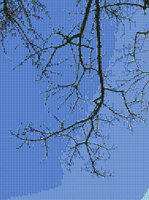

# mosaic
"mosaic" is a small Python library/app to generate photographic mosaics.  This
is where you take an original image, like

and turn it into

(Click on the image to see the full-sized version.)

It was originally created for a photography project so it doesn't have that many
features beyond specifying the image to generate a mosiac for.  In fact, the way
it's currently built will only let it generate mosaics from the
[CIFAR100](https://www.cs.toronto.edu/~kriz/cifar.html).  It's extendable, but
I (the author) don't have any plans to update it.
